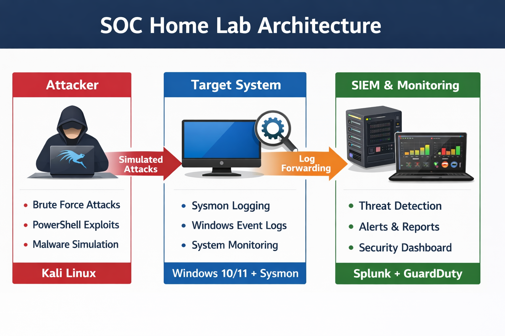

# 🔥 SOC Home Lab – SIEM Implementation & Threat Detection

# 📌 Overview

This project demonstrates a **real-world Security Operations Center (SOC) workflow** by building a home lab environment using SIEM tools to monitor, detect, and analyze cyber threats.

The lab simulates attacker activity and showcases how security analysts identify and respond to malicious behavior.

---

# 🧠 Key Objectives

* Build a SOC environment from scratch
* Simulate real-world cyber attacks
* Perform log analysis using SIEM
* Detect suspicious activities
* Create alerts & dashboards

---

# 🏗️ Lab Architecture



📌 Flow:
Attacker (Kali Linux) → Target (Windows + Sysmon) → SIEM (Splunk)

---

# 🧰 Tools & Technologies

* Splunk Enterprise (SIEM)
* Sysmon (System Monitoring)
* Kali Linux (Attack Simulation)
* Windows 10 (Target Machine)

---

# ⚙️ Implementation Steps

## 1️⃣ Environment Setup

* Created virtual lab using VMware/VirtualBox
* Configured attacker and target machines

📌 Why:
To replicate real-world attack-defense scenario

---

## 2️⃣ SIEM Setup (Splunk)

* Installed and configured Splunk

📌 Why:
Centralized log monitoring & analysis

---

## 3️⃣ Sysmon Deployment

* Installed Sysmon with configuration

📌 Why:
Enhanced visibility of system-level activities

---

## 4️⃣ Log Forwarding

* Forwarded logs to Splunk

📌 Why:
Centralized detection system

---

## 5️⃣ Attack Simulation

* Performed brute force attack
* Executed PowerShell commands

📌 Why:
Generate real attack logs for detection

---

## 6️⃣ Detection Engineering

* Created queries to detect:

  * Failed logins
  * Suspicious processes
  * PowerShell activity

📌 Why:
Core SOC skill

---

## 7️⃣ Alerting

* Configured alerts for suspicious activity

📌 Why:
Automated threat detection

---

## 8️⃣ Dashboard Creation

* Built visual dashboards

📌 Why:
Real-time monitoring & reporting

---

# 📊 Detection Queries

📂 Located in: `/queries`

Example:

```
index=wineventlog EventCode=4625
```

---

# 📸 Screenshots

| Step           | Description                        |
| -------------- | ---------------------------------- |
| Sysmon Install | screenshots/1-sysmon-install.png   |
| Logs           | screenshots/2-sysmon-logs.png      |
| Attack         | screenshots/4-attack-kali.png      |
| Detection      | screenshots/5-detection-query.png  |
| Alerts         | screenshots/6-alert.png            |
| Dashboard      | screenshots/3-splunk-dashboard.png |

---

# 🧾 Incident Report

📂 Located in: `/reports/incident-report.md`

Includes:

* Attack timeline
* Analysis
* Recommendations

---

# 🧠 Skills Demonstrated

* SIEM (Splunk)
* Log Analysis
* Threat Detection
* Incident Response
* Security Monitoring

---

# 💼 Resume Highlight

✔ Built a SOC Home Lab using Splunk and Sysmon to simulate and detect real-world cyber attacks, including brute force and PowerShell-based threats, with alerting and dashboard visualization.

---

# 🚀 Future Improvements

* Add MITRE ATT&CK mapping
* Integrate Threat Intelligence feeds
* Automate detection rules

---

# ⭐ Conclusion

This project demonstrates hands-on SOC analyst capabilities including detection, monitoring, and response in a simulated enterprise environment.

---

# 🔗 Author

Nitesh Vishwakarma

---
